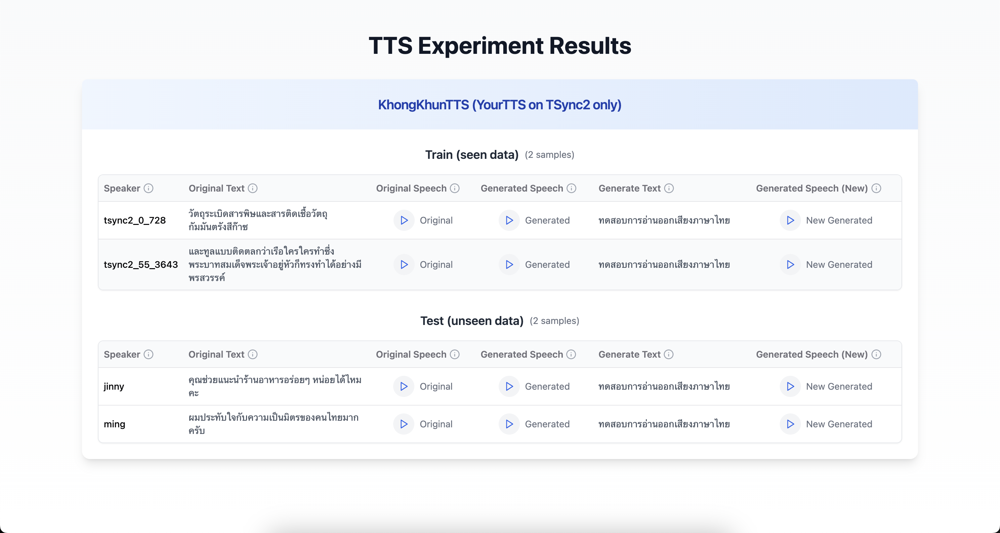

# Voice Cloning Demo Website

A web application for demonstrating voice cloning model outputs, built with Vite, React, TailwindCSS, and shadcn/ui components.

🔗 **[Live Demo](https://dubbing-ai.github.io/VoiceCloningDemo/)**



## Overview

This website provides an interactive interface to showcase and compare voice cloning model outputs, featuring:

- Original vs generated speech comparison
- Training (seen) vs test (unseen) data samples
- Interactive audio playback controls

## Tech Stack

- **Vite**: Next generation frontend tooling
- **React**: UI library with TypeScript support
- **TailwindCSS**: Utility-first CSS framework
- **shadcn/ui**: High-quality React components built with Radix UI and TailwindCSS

## Getting Started

1. Install dependencies:

   ```bash
   yarn install
   ```

2. Run development server:

   ```bash
   yarn dev
   ```

3. Build for production:

   ```bash
   yarn build
   ```

## Features

The demo currently showcases:

- **KhongKhunTTS Model**: YourTTS trained on TSync2 dataset
- Side-by-side comparisons of:
  - Original text and speech
  - Generated speech from original text
  - New text input and corresponding generated speech
- Interactive audio player with play/pause controls
- Responsive design with clean UI components
- Helpful tooltips for additional information

## Project Structure

```plaintext
src/
  components/
    ui/          # shadcn/ui components
  App.tsx        # Main application component
  index.css      # Global styles and Tailwind directives
  main.tsx       # Application entry point
```

## Development

- Uses TypeScript for type safety
- ESLint for code quality
- Tailwind for styling
- Path aliases configured for clean imports
- GitHub Actions workflow for automated deployment

## Adding New Samples

To add new voice cloning samples:

1. Add audio files to `public/wav/`
2. Update the data structures in `App.tsx`
3. The samples will automatically be organized into training and test sections

## Deployment

The project automatically deploys to GitHub Pages when changes are pushed to the main branch.